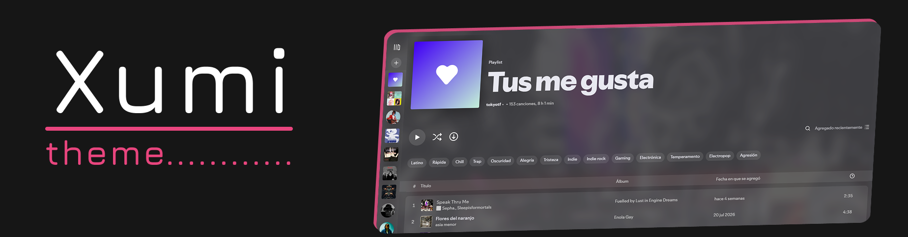

# Xumi

Modern dark Spicetify theme with custom window controls, cover-art blurred background with crossfade, floating glass player bar and a redesigned Marketplace.



## Features

- **Custom window controls** (minimize / maximize / close) via `DesktopWindowState`, with one-click restore of the native buttons
- **Cover-art background**: blurred, with smooth fade on track change
- **Floating glass player bar**, round artwork, subtle scrollbar
- **Player icon toggles**: show/hide shuffle, prev, play, next, repeat, lyrics, mini player, volume, devices, queue, fullscreen and cover art from *Configure Xumi* in the profile menu
- **Now Playing view**: auto-close on startup and/or hide via CSS
- **Redesigned Marketplace**: segmented tab bar, segmented sort/search header, styled dropdowns, horizontal extension/snippet/app cards, overlay theme cards

## Install (manual)

1. Copy this folder to your Spicetify themes directory:
   - Windows: `%appdata%\spicetify\Themes\Xumi`
   - Linux/macOS: `~/.config/spicetify/Themes/Xumi`
2. Apply:
   ```sh
   spicetify config current_theme Xumi color_scheme Base
   spicetify apply
   ```
3. Restart Spotify.

> Do **not** use the `noControls` extension together with Xumi — the theme already manages the native window buttons itself and they will conflict.

## License

MIT
